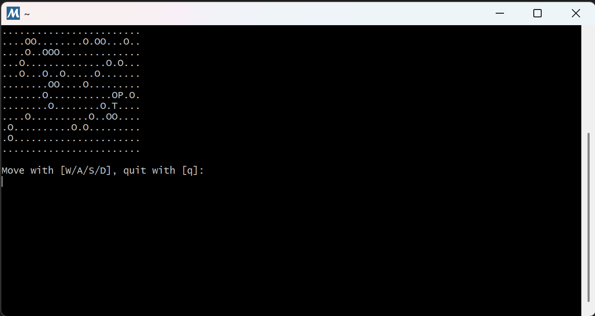
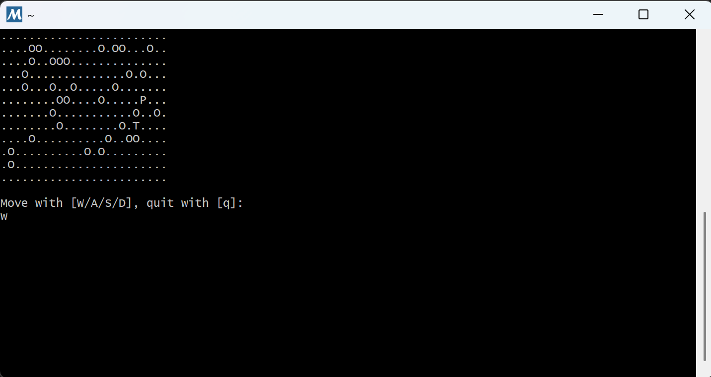
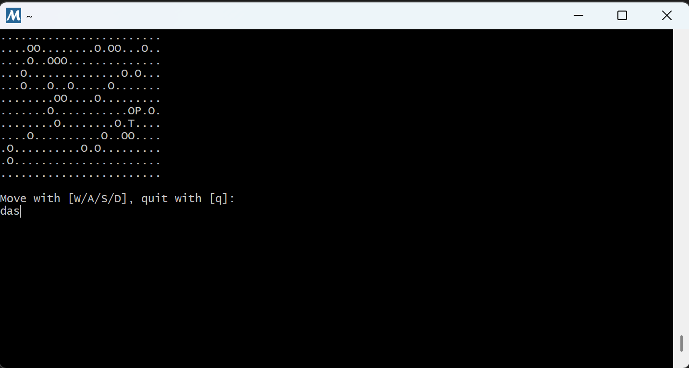
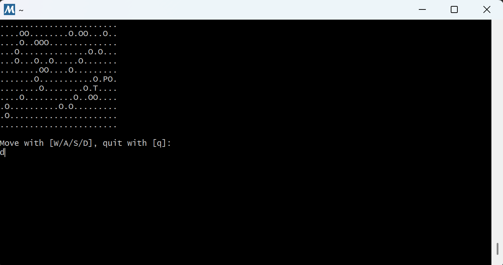
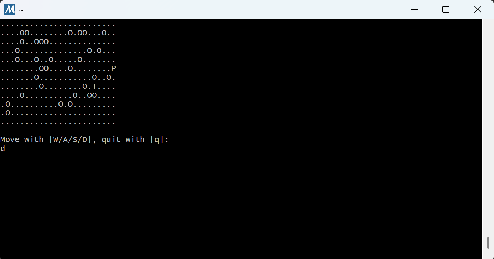
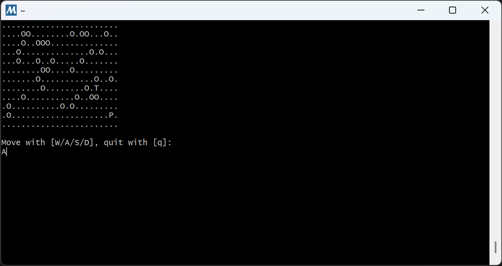
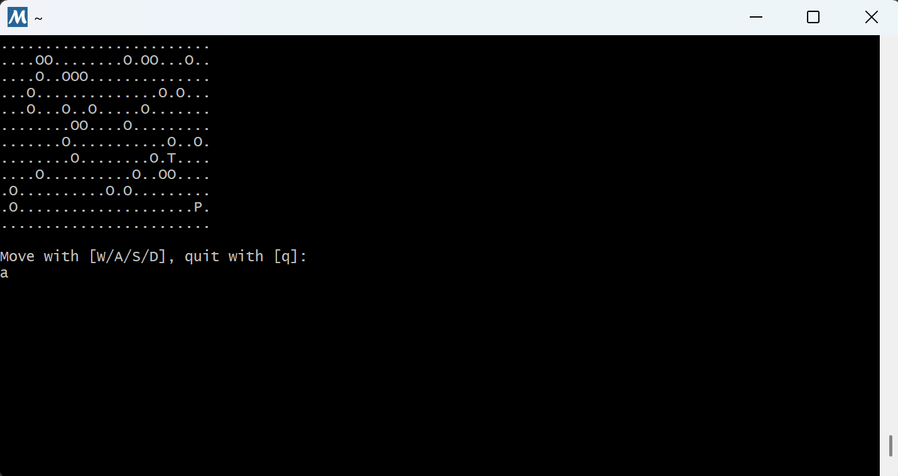
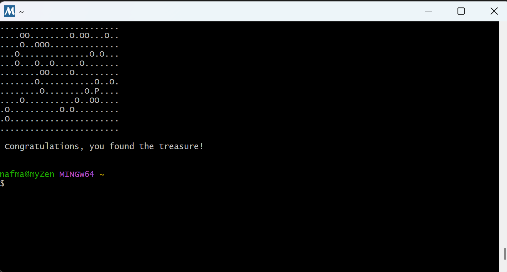
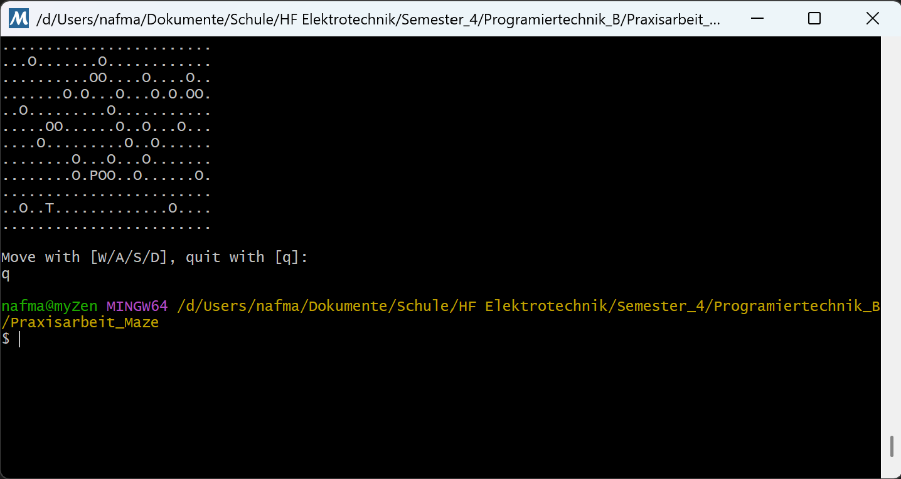

# Praxisarbeit Elektrotechniker HF – Programmiertechnik (Labyrinth in C) 
Manuel Näf  · Lukas Müller · 05.10.2025

---

## 1. Management Summary

**Zweck & Kontext.**  
Die Arbeit demonstriert den Transfer der Inhalte aus Programmiertechnik A/B in eine praxistaugliche Konsolenanwendung: ein textbasiertes Labyrinth-Spiel in C. Ziel war eine saubere Umsetzung mit nachvollziehbarem Design, reproduzierbarem Build und überprüfbaren Tests.

**Lösung in Kürze.**  
Die Applikation ist modular aufgebaut (`maze`, `game`, `main`) und arbeitet auf einem 12×24-Raster mit den Symbolen `P` (Spieler), `T` (Schatz), `O` (Hindernis) und `.` (leer). Die Steuerung erfolgt über **W/A/S/D** (jeweils mit Enter). Nach jedem gültigen Zug wird das Labyrinth **neu gezeichnet**. Die Siegbedingung ist erfüllt, sobald der Spieler die Schatz-Zelle betritt. Eingaben werden validiert, Rand- und Hinderniskollisionen blockieren Bewegungen. Der Build erfolgt reproduzierbar via **Makefile** (C11, `-Wall -Wextra -O2`), entwickelt auf **Windows 11** mit **MSYS2 MinGW64** und **GCC 15.2.0**.

**Ergebnisse & Nachweis.**  
Alle Muss-Anforderungen wurden erfüllt. Die Akzeptanztests **T01–T09** (Start, Bewegung, Blockade, Randprüfung, ungültige Eingaben, Case-Insensitivity, Sieg, Quit) sind bestanden; Screenshots und Logs sind im Repository abgelegt. Diagramme (Flowchart) und eine knappe Projektdokumentation liegen bei.

**Aufwand & Learnings.**  
Der Aufwand lag **im Rahmen der Vorgabe (≈ 25–30 h)**. Wesentliche Lerngewinne: **Makefile-Grundlagen** (Targets, Pattern-Rules, Dependenz-Tracking mit `-MMD -MP`), bewusster Einsatz von **Compiler-Flags**, saubere **Modularisierung in C** (Trennung Header/Implementierung), robuste **Konsolen-I/O** (zeilenweise Eingabe, Entprellen), sowie **Determinismus** für reproduzierbare Tests.

**Empfehlung / Nächste Schritte.**  
Parametrisierung von Rastergrösse/Hindernisdichte (CLI-Optionen), einfache **Testautomatisierung** (Eingabe-Skripte, Golden-Files), Prüfung der **Portabilität** (Terminals ohne ANSI-Escapes) und optionale Erweiterungen (Schwierigkeitsgrade, Pfadfinde-Logik).

---

## 2. Anforderungen & Aufgabenstellung
- **Zielsetzung der Arbeit**  
  Transfer der Inhalte aus Programmiertechnik A/B in eine praxistaugliche Konsolenanwendung (Labyrinth-Spiel in C).

**Spielanforderungen (Pflicht):**
- 2D-Labyrinth als Array; Symbole: `P` (Spieler), `T` (Schatz), `O` (Hindernis); Zufallspositionen.  
- Bewegung via **W/A/S/D**; Eingabe mit **Return** bestätigen; vollständiger **Re-Draw** nach jeder Eingabe.  
- Siegbedingung: Schatz gefunden → Siegesmeldung.
- Abbruch des Spiels mit **Q**

**Teilaufgaben (Pflicht):**
- Design (Fluss-/Struktogramm)  
- Implementierung (Modularisierung, Code-Stil)  
- Lesbarkeit/Wartbarkeit (Kommentare)  
- Eingabeprüfung  
- Testing  
- Dokumentation gemäss Aufbau (Kap. 1–7)

**Rahmenbedingungen:**
- Einzelarbeit; 25–30 h  
- Tools: Editor, C-Compiler, GitHub/Codespaces, Office

**Abgabe:**
- **Lösungsdokument als Pdf**
- **GitHub-Repository** mit **komplettem C-Projekt** und **mehreren C-Modulen** (alle Quelldateien, Build-Skripte).  
- **Einreichung:** Link zum Repository per Teams an den Dozenten.

### Dokumentumfang
- Mindestens **8 Seiten ohne Management Summary**; relevante Diagramme enthalten.

### Akzeptanz- und Bewertungskriterien
- **Formale Aspekte:** alle Fragestellungen beantwortet, korrekte Fachsprache, saubere Quellenangaben.  
- **Thematische Güte:** angemessener Tiefgang; korrekte Anwendung von Algorithmen, Datenstrukturen und C-Grundlagen.  
- **Nachvollziehbare Vorgehensweise:** roter Faden von Anforderungen → Design → Implementierung → Test.  
- **Praxistauglichkeit:** funktionsfähiges Ergebnis, klare Siegesbedingung; prägnantes Management Summary.

### Abgrenzung (Nicht-Ziele)
- Keine Grafikausgabe/GUI; reine **Konsolenanwendung**.  
- Kein erweiterter Pfadfinder/AI über die Mindestanforderungen hinaus.  
- Keine Persistenz/Dateispeicherung.

### Annahmen/Randbedingungen
- Zielumgebung: Konsole; Compiler
- Tastatur-Layout: QWERTZ.  
- Zufallsinitialisierung: definierte `seed`-Strategie (reproduzierbar für Tests).

---

## 3. Design

### 3.1 Überblick & Annahmen

**Zielbild.** Eine schlanke Konsolenanwendung, die ein 2D-Labyrinth als Zeichenraster darstellt und den Spieler (`P`) mit W/A/S/D jeweils um **eine Zelle** bewegt. Das Spiel endet, sobald der Spieler die Schatz-Zelle (`T`) erreicht; Hindernisse (`O`) sind unpassierbar.

**Spielfeld & Symbolik.**
- Rastergrösse: **12 × 24** (Zeilen × Spalten), `g_maze[MAZE_ROWS][MAZE_COLS]`.
- Zellen-Codes: `.` (leer), `O` (Hindernis), `P` (Spieler), `T` (Schatz).
- Koordinatenkonvention (aus den Headern):
  - `Pos.x` = **Spaltenindex** `0..MAZE_COLS-1`
  - `Pos.y` = **Zeilenindex** `0..MAZE_ROWS-1`
  - Rasterzugriff: `g_maze[y][x]` (Zeile, dann Spalte).

**Steuerung & IO.**
- Eingabe: **W/A/S/D** (case-insensitive), **Return** bestätigt; `getchar()` liest das Zeichen, Rest der Zeile wird verworfen.
- Ausgabe/Redraw: vollständiges Neuzeichnen des Rasters pro Eingabe; Konsolen-Clear via ANSI-Sequenzen `\x1b[2J\x1b[H`.

**Zufall/Seed.**
- `game_init()` seedet den RNG, initialisiert das Labyrinth und platziert Spieler/Schatz auf **verschiedenen** leeren Zellen.
- Dichte der Hindernisse standardmässig **0.15** (15 %), konfigurierbar über Parameter.

**Abgrenzungen.**
- Reine **Konsolenanwendung**: keine GUI, keine Dateispeicherung.
- Pro Zug wird **genau eine** Bewegungsrichtung verarbeitet.

---

### 3.2 Architektur & Modularisierung

**Modulübersicht**

#### `maze.c/.h`
- **Verantwortung:** Datenhaltung des Rasters; Initialisierung; Hindernisstreuung; Randbegrenzung; Rendering-Helfer  
- **API:**  
  `maze_seed_random()`, `maze_clear()`, `maze_add_borders()`,  
  `maze_scatter_obstacles(density)`, `maze_init(density)`,  
  `maze_is_cell_empty(x,y)`, `maze_place_random(symbol)`, `maze_find(symbol)`,  
  `maze_draw()`, `g_maze`, `Pos`

#### `game.c/.h`
- **Verantwortung:** Spielzustand (`GameState`); Platzierung von `P`/`T`; Bewegungsregeln; Siegprüfung  
- **API:**  
  `game_init(GameState*, float)`, `game_is_won(const GameState*)`,  
  `game_try_move(GameState*, MoveDir)`, `MoveDir`

#### `main.c`
- **Verantwortung:** Konsolen-Front-End (Game-Loop, Ein-/Ausgabe, Redraw, Beenden)  
- **API:** `main()`

**Datenmodell.**
- **`GameState`** hält die **Positionen** von Spieler und Schatz.
- **Raster**: globales `char g_maze[12][24]` (Zeilen-major).
- **`MoveDir`**: `MOVE_UP`, `MOVE_DOWN`, `MOVE_LEFT`, `MOVE_RIGHT`.

**Kopplung & Verantwortlichkeiten.**
- `game.c` **besitzt** die Spielregeln (Bewegung/Sieg) und **nutzt** `maze`-Funktionen, ändert jedoch nur `P`/`T`-Markierungen im Raster.
- `main.c` **orchestriert**: Init → Loop (Draw → Input → Move/Update → Win-Check).

---

### 3.3 Algorithmen & Datenstrukturen

**Initialisierung.**
1. `game_init(gs, density)`:
   - RNG seeden (`maze_seed_random()`).
   - `maze_init(density)` → `maze_clear()` → `maze_add_borders()` → `maze_scatter_obstacles(density)`.
   - Spieler (`P`) und Schatz (`T`) **auf leeren, unterschiedlichen** Zellen platzieren (z. B. via `maze_place_random()`).

**Hindernisstreuung.**
- Gleichverteilte Auswahl in der **Innenfläche** (Ränder ausgeschlossen).
- Ziel: etwa `density * (Innenzellen)` werden zu `O`. Kollisionen mit bereits gesetzten Zellen werden vermieden.

**Eingabe/Bewegung.**
- Mapping: `W→UP`, `S→DOWN`, `A→LEFT`, `D→RIGHT` (case-insensitive).
- `game_try_move(gs, dir)`:
  - Kandidat `(nx, ny)` = `(x + dx, y + dy)`.
  - **Bounds-Check**: `0 ≤ nx < MAZE_COLS`, `0 ≤ ny < MAZE_ROWS`.
  - **Kollisions-Check**: Zielzelle darf **nicht** `CELL_OBSTACLE` sein.
  - Bei Erfolg: Spielerposition aktualisieren; Raster-Markierung für `P` entsprechend setzen.
  - Misslingt: Position unverändert; optional Feedback in `main.c`.

**Siegbedingung.**
- `game_is_won(gs)` → `true`, wenn `gs->player.x == gs->treasure.x && gs->player.y == gs->treasure.y`.
- Hinweis aus `game.h`: Betreten von `T` ist zulässig; die Zelle zeigt dann `P`.

**Komplexität.**
- Initialisierung: **O(R·C)**.  
- Pro Zug: **O(1)** für Move/Check/Update; **O(R·C)** für das Redraw (Druck aller Zellen).

**Fehler- & Eingabebehandlung.**
- Ungültiges Zeichen: wird ignoriert; Zeile wird bis `\n` verworfen.
- Randkollision/Hindernis: kein Positionswechsel.

---

### 3.4 Diagramme (Pflicht)

**Flussdiagramm – Game-Loop**

---

## 4. Implementierung

### 4.1 Entwicklungsumgebung & Build

**Betriebssystem & Shell**  
- **OS:** Windows 11  
- **Shell/Umgebung:** MSYS2 **MinGW64**

**Compiler**  
- **GCC:** `gcc.exe (Rev8, Built by MSYS2 project) 15.2.0`

**C-Standard & Flags**  
- **C-Standard:** C11  
- **CFLAGS (Makefile):** `-std=c11 -Wall -Wextra -O2 -Isrc`

**Projektstruktur **
~~~
<PRAXISARBEIT_MAZE>/
  doc/
    loesungsdokument/
      Diagrams/
        flowchart/
          flowchart_game-maze.drawio
          flowchart_game-maze.drawio.pdf
          flowchart_game-maze.drawio.png
      img/
        test/
          T01_start.png
          T02_move_w.png
          ...
          T09_quit.png
      Arbeitsauftrag-Praxisarbeit.pdf
      loesungsdokument.md
      loesungsdokument.pdf
      Management-Summary
  logs/
  src/
  .gitignore
  Makefile
  README.md

~~~

**Buildsystem (Makefile – Kerndaten)**  
- **Ziel:** `bin/labyrinth.exe`  
- **Quellen:** automatisch alle `src/*.c`  
- **Objekte & Dependenzdateien:** `build/*.o`, Dep-Dateien via `-MMD -MP`  
- **Wichtige Targets:** `all` (Default), `run`, `clean`  
- **Auszug:**
~~~
TARGET := labyrinth
CC := gcc
CFLAGS := -std=c11 -Wall -Wextra -O2 -Isrc

SRCS := $(wildcard src/*.c)
BIN  := bin
BUILD:= build
~~~

**Build-/Run-Befehle (gemäss README)**
~~~
# Build
make

# Run
make run
~~~

---

### 4.2 Modulbeschreibung

#### `maze.c / maze.h`
- **Verantwortung:** Verwaltung des Rasters; Initialisierung (leeren, Ränder setzen); Hindernisstreuung im Innenbereich; einfache Render-Helfer; zufällige Platzierung von Symbolen.
- **Öffentliche API (Auszug):**
  ~~~c
  void  maze_seed_random(void);
  void  maze_clear(void);
  void  maze_add_borders(void);
  void  maze_scatter_obstacles(float density);
  void  maze_init(float density);

  bool  maze_is_cell_empty(int x, int y);
  Pos   maze_place_random(char symbol);
  Pos   maze_find(char symbol);

  void  maze_draw(void);  // optionales Zeichnen nach stdout
  ~~~
- **Sichtbare Daten/Typen & Konstanten:**
  ~~~c
  #define MAZE_ROWS 12
  #define MAZE_COLS 24
  #define OBSTACLE_DENSITY 0.15f

  #define CELL_EMPTY    '.'
  #define CELL_OBSTACLE 'O'
  #define CELL_PLAYER   'P'
  #define CELL_TREASURE 'T'

  typedef struct { int x, y; } Pos;
  extern char g_maze[MAZE_ROWS][MAZE_COLS];
  ~~~
- **Invarianten:**
  - Aussenrand ist mit `CELL_OBSTACLE` belegt.
  - Hindernisse werden nur im **Innenbereich** gestreut.
  - `maze_place_random` liefert nur **leere Innenzellen**.

---

#### `game.c / game.h`
- **Verantwortung:** Spielzustand halten (`GameState`), Platzierung von Spieler/Schatz, Bewegungsregeln, Siegprüfung.
- **Öffentliche Typen & API:**
  ~~~c
  typedef struct {
      Pos player;
      Pos treasure;
  } GameState;

  typedef enum { MOVE_UP, MOVE_DOWN, MOVE_LEFT, MOVE_RIGHT } MoveDir;

  void  game_init(GameState *gs, float obstacle_density);
  bool  game_is_won(const GameState *gs);
  bool  game_try_move(GameState *gs, MoveDir dir);
  ~~~
- **Regeln:**
  - Ein Schritt pro Eingabe; Zielzelle muss **in Bounds** und **nicht `O`** sein.
  - Betritt `P` die Schatz-Zelle, gilt das Spiel als **gewonnen** (Zelle zeigt visuell `P`).

---

#### `main.c`
- **Verantwortung:** Konsolen-Front-End (Game-Loop), Ein-/Ausgabe, Redraw, Beenden.
- **Ablauf (vereinfacht):**
  1) `game_init(&gs, OBSTACLE_DENSITY)`  
  2) **Loop:**  
     - Bildschirm löschen (ANSI `\x1b[2J\x1b[H`), Raster ausgeben  
     - **Sieg prüfen** → ggf. Meldung & Ende  
     - **Eingabe** lesen (`W/A/S/D` oder `q`, jeweils mit **Enter**)  
     - **Bewegung** via `game_try_move`  
     - Eingabezeile bis `'\n'` **leeren** (Entprellen)  
- **Bemerkung:** Die Siegprüfung erfolgt zu Beginn der nächsten Iteration **nach** einem Zug; dadurch ist „Sieg nach jeder Bewegung prüfen“ erfüllt.

---

### 4.3 Wichtige Implementierungsdetails

**Speicher- & Datenmodell**
- Statisches Raster `g_maze[MAZE_ROWS][MAZE_COLS]` (Zeilen-major: Zugriff **`g_maze[y][x]`**).
- `Pos.x` = Spalte `0..MAZE_COLS-1`, `Pos.y` = Zeile `0..MAZE_ROWS-1`.
- `GameState` speichert aktuelle Positionen von **Spieler** und **Schatz**.

**Initialisierung & Seeding**
- `game_init` ruft `maze_seed_random` auf, initialisiert das Raster über `maze_init(density)` und platziert **`P`** und **`T`** auf **verschiedenen** leeren Innenzellen.
- Empfohlene Dichte: `0.15f` (15 % der Innenzellen als Hindernisse).

**Hindernisstreuung (Innenbereich)**
- Gleichverteilte Auswahl; Zielzahl ≈ `density × (#Innenzellen)`.
- Ränder bleiben Hindernisse; bestehende Symbole werden nicht überschrieben.

**Platzierung von Spieler & Schatz**
- `maze_place_random('P')` wählt eine leere Innenzelle für den Spieler.  
- `maze_place_random('T')` wählt eine **andere** leere Innenzelle für den Schatz (bei Kollision erneute Ziehung).

**Bewegungslogik (ein Feld pro Zug)**
- Mapping: `W→UP`, `S→DOWN`, `A→LEFT`, `D→RIGHT` (gross/klein egal).
- Ziel `(nx, ny)` wird aus `(x+dx, y+dy)` berechnet; Bewegung nur, wenn **in Bounds** und Ziel != `O`.
- Bei Erfolg wird `P` im Raster versetzt; andernfalls bleibt die Position unverändert.

**Eingabe & Entprellen**
- Tasten werden über `getchar()` eingelesen; der Rest der Zeile wird bis zum **Zeilenumbruch** verworfen, damit die nächste Eingabe ein frisches Zeichen erhält.
- `q`/`Q` beendet den Loop.

**Redraw**
- Jede Iteration beginnt mit **Clear & Draw**.  
- Dadurch wird nach einer erfolgreichen Bewegung in der vorigen Iteration das neue Raster unmittelbar sichtbar.

**Siegprüfung**
- `game_is_won(&gs)` meldet **true**, sobald `player == treasure`.  
- Die Prüfung erfolgt zu Beginn der nächsten Iteration direkt **nach** dem Redraw.

**Fehler- & Randfälle**
- **Ungültige Eingaben:** werden ignoriert; der Loop läuft weiter.  
- **Randkollision:** Bewegung wird verworfen (Position bleibt).  
- **Volle Innenfläche:** Falls keine leeren Zellen vorhanden sind, gibt `maze_place_random` `{ -1, -1 }` zurück; dieser Fall ist im normalen Betrieb durch die gewählte Dichte unwahrscheinlich und kann im Test dokumentiert werden.

**Leistung**
- **Initialisierung:** O(R·C)  
- **Zug-Logik:** O(1)  
- **Ausgabe (Redraw):** O(R·C) pro Iteration (Konsolen-Druck aller Zellen)

**Lesbarkeit/Wartbarkeit**
- Klare Header-Guards, sprechende Namen (`CELL_*`, `MoveDir`, `GameState`).  
- Öffentliche Schnittstellen in `.h`, Implementierungsdetails in `.c`.  
- Kommentare erklären **Koordinatenkonvention** und **Rasterzugriff** explizit.

**Pseudocode (Bewegung)**
~~~text
function game_try_move(gs, dir):
    (dx, dy) := map_dir(dir)         // z. B. UP=(0,-1), RIGHT=(+1,0)
    nx := gs.player.x + dx
    ny := gs.player.y + dy
    if 0 ≤ nx < MAZE_COLS and 0 ≤ ny < MAZE_ROWS and g_maze[ny][nx] != 'O':
        // Spieler im Raster versetzen
        gs.player := (nx, ny)
        return true
    else:
        return false
~~~

---

## 5. Test

### 5.1 Teststrategie
- Manuelle **Black-Box-Tests** gegen die Muss-Anforderungen (Anzeige, Bewegung, Blockade, Sieg, Eingabeprüfung).
- Ausführung in konsistenter Umgebung (Windows 11, MSYS2 MinGW64, GCC 15.2.0).
- Nachweis durch **Screenshots** und **Logs** im Repository.

---

### 5.2 Testfälle

- **T01 – Startzustand:** Programmstart → Gitter sichtbar; genau 1× `P`, 1× `T`; Hindernisse `O`; Rest `.`  
- **T02 – Bewegung nach oben:** `W` + Enter → `P` bewegt sich um 1 Feld nach oben; **Neu-Zeichnung**  
- **T03 – Bewegung rechts/links/unten:** `D` / `A` / `S` + Enter → `P` bewegt sich je um 1 Feld; **Neu-Zeichnung**  
- **T04 – Hindernis blockiert:** Zug in Richtung `O` → Position unverändert (Bewegung verhindert)  
- **T05 – Randprüfung:** Zug über Feldrand → Out-of-Bounds verhindert; Position unverändert  
- **T06 – Ungültige Eingabe:** z. B. `X` + Enter → Keine Bewegung; Programm bleibt stabil  
- **T07 – Gross-/Kleinschreibung:** `w/a/s/d` vs. `W/A/S/D` → Gleichwertige Steuerung (case-insensitive)  
- **T08 – Siegbedingung:** `P` auf `T` bewegen → Siegesmeldung; reguläres Programmende  
- **T09 – Beenden:** `q` / `Q` + Enter → Programm beendet kontrolliert

---

### 5.3 Testergebnisse (Screenshots)

- **T01 Start**  
  

- **T02 Move W**  
  

- **T03 Move D/A/S**  
  

- **T04 Block durch Hindernis**  
  

- **T05 Randprüfung**  
  

- **T06 Ungültige Eingabe**  
  

- **T07 Case-Insensitivity (1/2)**  
  

- **T07 Case-Insensitivity (2/2)**  
  

- **T08 Siegbedingung**  
  

- **T09 Quit**  
  

---

### 5.4 Abdeckung der Anforderungen (Traceability)

| Muss-Anforderung                                                                 | Nachweis (Tests)                  |
|----------------------------------------------------------------------------------|-----------------------------------|
| 2D-Spielfeld mit Symbolen `P`, `T`, `O`, `.` sichtbar                            | T01, T02–T05                      |
| Bewegung mit **W/A/S/D** um genau 1 Feld; **Enter** bestätigt                    | T02, T03                          |
| Nach jedem **gültigen** Zug: vollständiges **Neu-Zeichnen**                      | T02, T03                          |
| Hindernisse und Rand verhindern den Zug                                          | T04, T05                          |
| Ungültige Eingaben führen nicht zu Abstürzen                                     | T06                               |
| Gross-/Kleinschreibung der Steuerung egal                                        | T07                               |
| Siegbedingung (P betritt T) → Siegesmeldung, reguläres Programmende              | T08                               |
| Beenden via `q/Q`                                     | T09                               |

---

### 5.5 Evidenz & Ablage

- **Screenshots:** `doc\loesungsdokument\img\test\T01_start.png` (siehe 5.3).  
- **Logs:** `logs/build_ok.txt`, `logs/run_session.txt`, `logs/run_session_raw.txt`.  
- **Build/Run-Hinweis:** siehe README und Kapitel 4.1 (Makefile-Targets).

---

### 5.6 Ergebnisübersicht

- **Status:** Alle geplanten Tests bestanden (**9/9**).  
- **Bemerkung:** Verhalten entspricht den Anforderungen; keine Abstürze bei ungültiger Eingabe; korrekte Blockade an Hindernissen/Rand; Sieg- und Quit-Pfade funktionieren.

---

## 6. Lessons Learned

### 6.1 Technik – was ich gelernt habe
- **Makefile-Grundlagen:** Targets (`all`, `run`, `clean`), Variablen (`CC`, `CFLAGS`, `SRCS`), Pattern-Rules und automatische Quellsuche mit `$(wildcard src/*.c)`.  
- **Inkrementelles Bauen:** Objekt- und Dependenzdateien in `build/`, finaler Output in `bin/`; schnelleres Rebuild durch getrennte Compile-/Link-Schritte.  
- **Abhängigkeits-Tracking:** `-MMD -MP` erzeugt `.d`-Dateien, so dass Änderungen an Headern automatisch neu kompiliert werden.  
- **Compiler-Flags bewusst wählen:** `-std=c11 -Wall -Wextra -O2 -Isrc` – dadurch früher Fehler/Warnungen gesehen und Codequalität verbessert.  
- **Modularisierung in C:** Saubere Trennung von **Schnittstellen** (`.h`) und **Implementierungen** (`.c`); klarer API-Vertrag zwischen `maze` und `game`.  
- **Koordinatensystem & Speicherlayout:** Row-major Zugriff `g_maze[y][x]`; Vermeidung von Vertauschungen (`x`=Spalte, `y`=Zeile).  
- **Eingabe-Handhabung in der Konsole:** Zeilenweise Eingabe mit `getchar()`; Rest der Zeile bis `'\n'` verwerfen, um sauberes „Entprellen“ zu erreichen; Gross-/Kleinschreibung normalisieren.  
- **Redraw & ANSI-Escapes:** Vollständiges Neuzeichnen pro Zug und Clear via `\x1b[2J\x1b[H`; Bewusstsein für Terminal-Kompatibilität geschaffen.  
- **Determinismus für Tests:** Seed/Random bewusst behandeln (zeitbasiert vs. fixer Seed) für reproduzierbare Screenshots und Testläufe.

### 6.2 Vorgehen/Prozess – was gut funktioniert hat
- **Anforderungen → Design → Implementierung → Test:** Der rote Faden hat geholfen, Scope zu halten.  
- **Kleine, überprüfbare Schritte:** Erst Konsolen-Ausgabe stabilisieren, dann Bewegung, erst danach Hindernisse/Siegprüfung.  
- **Dokumentation parallel zum Code:** Diagramme und Testliste früh angelegt; Screenshots als Evidenz systematisch abgelegt 

### 6.3 Hürden und wie ich sie gelöst habe
- **Vertauschte Indizes (`x/y`):** Mit klarer Konvention im Header und konsequenter Nutzung `g_maze[y][x]` behoben.  
- **Eingabepuffer/Mehrfacheingaben:** Durch das Leeren bis `'\n'` und Case-Insensitivity stabilisiert.  
- **Unsaubere Rebuilds:** Durch Makefile-Aufteilung in `build/` und Dependenzdateien gelöst.  
- **Rand-/Hinderniskollisionen:** Explizite Bounds-/Zellprüfungen vor Positionswechsel implementiert.

### 6.4 Was ich beim nächsten Mal anders machen würde
- **Noch strengere Warnungen/Checks:** z. B. zusätzliche Flags (nur wenn nötig) und statische Analyse.  
- **Testautomatisierung:** Einfache Skripte, die Eingaben einspeisen und Ausgaben vergleichen, um Screenshots/Logs zu ergänzen.  
- **Konfigurierbarkeit:** Grid-Grösse und Hindernisdichte über Parameter/Flags steuerbar machen.  
- **Portabilität expliziter prüfen:** Klarere Fallbacks, falls ANSI-Escapes in gewissen Terminals nicht unterstützt sind.

**Fazit:** Von „kein Makefile-Wissen und wenig Compiler-Erfahrung“ zu einer **reproduzierbaren Build-Pipeline**, einer **klar modularisierten C-Lösung** und einer **nachvollziehbaren Testdokumentation** – das Projekt hat meine Basis in Build-Systemen, C-Modularisierung und Konsolen-I/O deutlich gestärkt.

---

## 7. Anhang

### 7.A Build-/Run-Anleitung
Ausführen in der Projektwurzel.
~~~bash
# Build
make

# Start
make run
~~~

### 7.B Diagramm(e) – vollgross

### 7.C GitHub-Repository
- Komplettes C-Projekt mit Makefile: **(https://github.com/moerf98/Praxisarbeit_Maze)**

### 7.D Quellen / Referenzen
- Aufgabenstellung: [`../Arbeitsauftrag-Praxisarbeit.pdf`](Arbeitsauftrag-Praxisarbeit.pdf)